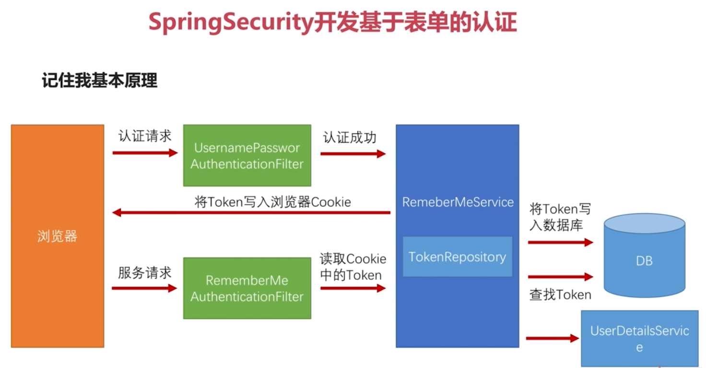

# spring-security

## springSecurity开发基于表单的认证

### 自定义用户认证逻辑

* 处理用户信息获取逻辑    `UserDetailsService`
* 处理用户校验逻辑         `UserDetails`
* 处理密码加密解密         `PasswordEncoder` 

#### 步骤
1、实现`UserDetailsService`——`MyUserDetailsService`,并使用注解`@Configuration`；

2、在实现类`MyUserDetailsService`中添加一个`@Bean`；

3、处理加解密使用`PasswordEncoder`。
```java
    @Component
    @Slf4j
    public class MyUserDatailsService implements UserDetailsService {
    
        @Autowired
        private PasswordEncoder passwordEncoder;
    
        @Override
        public UserDetails loadUserByUsername(String username) throws UsernameNotFoundException {
            log.info("登陆用户名：{}",username);
            //根据用户名查找用户信息——从数据库中要读取出来的，passwordEncoder.encode方法是加密时使用的，这里应该只读取数据库的密码
            String password = passwordEncoder.encode("123456");
            log.info("密码为：{}",password);
            return new User(username, password,true,true,true,true, AuthorityUtils.commaSeparatedStringToAuthorityList("ADMIN"));
        }
    }
```
### 个性化用户认证流程

* 自定义登录页面  `http.formLogin().loginPage("/signIn.html)`
* 自定义登录成功处理——实现`AuthenticationSuccessHandler`接口
* 自定义登录失败处理——实现`AuthenticationFailureHandler`接口

### 实现图形验证码功能

* 开发生成图形验证码接口
    * 根据随机数生成图片—— `CreateCodeImage`生成图片验证码
    * 将随机数存到session中——存放入`SessionStrategy`
    * 在将生成的图片写到接口响应中——使用`ImageIO.write`将图片io流传送到页面
* 在认证流程中加入图形验证码校验
    * 开发生成图形验证码的接口——前面分三步做完了
    * 认证流程中加入图形验证码的校验
        * 添加校验过滤器——`ValidateCodeFiter`（验证码过滤器），错误信息提交给`ValidateCodeException`继承
        `AuthenticationException`，实现其父类构造方法即可
        * 在`BrowserSecurityConfig`中把验证码过滤器放在`UsernamePasswordAuthenticationFilter`前，同时把
        过滤器设置使用`myAuthenticationFailureHandler`进行拦截
* 重构代码
    * 验证基本参数可以配置（大小，长度，有效时间可配），要做成三级配置：
    ``` 默认配置（写在croe）-->应用级配置（写在demo中）-->请求级配置（配置值在调用接口时传递）```
    * 拦截的接口可以配置——`/user/login`可以配置，不同应用需要验证码
    * 验证码的生成逻辑可以配置——`以增量方式去适应变化 `（当逻辑更改时，原来代码不能适应，不能更改原来代码，
    而是增加一些代码实现新的逻辑即可）。这里注意到接口实现类不直接实用`@Compent`注解，而是使用加载Bean方式，
    使用` @ConditionalOnMissingBean(name = "imageCodeGenerator")`加载bean方式，方便`以增量方式去适应变化 `。
### 实现“记住我”功能
* 记住我功能基本原理
    
    
    
    
* 记住我功能具体实现
* 记住我功能SpringSecurity源码解析
